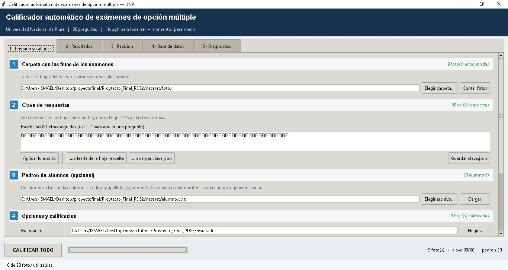
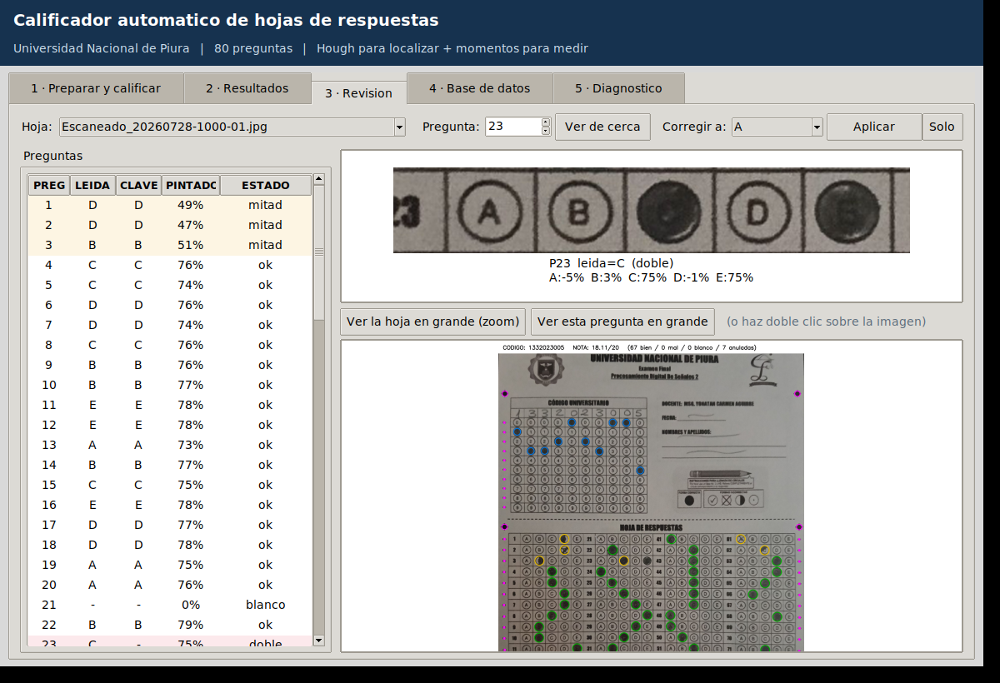

# Calificador automático de exámenes de opción múltiple

Sistema automático de calificación de exámenes de opción múltiple usando la
**Transformada de Hough** para detectar los círculos de respuesta y **momentos
espaciales** (`cv2.moments`) para determinar la opción marcada.

Proyecto final del curso **Procesamiento Digital de Señales 2**
Escuela de Ingeniería Electrónica y Telecomunicaciones — Universidad Nacional de Piura

## 👥 Integrantes

| # | Apellidos y Nombres |
|---|---------------------|
| 1 | Cordova Malca Ismael Osmar |
| 2 | Guerrero Guerrero Erick Jair |
| 3 | Lizana Huancas Franzel |
| 4 | Peña Ipanaque Joel |
| 5 | Sosa Troncos Daniel Alexander |
| 6 | Tuesta Peña Kurt Brian |
| 7 | Yañez Manrique Rigoberto David |

---

## Descripción general

El sistema recibe una carpeta con fotografías o escaneos de hojas de respuestas,
localiza cada hoja dentro de la imagen, corrige su perspectiva, detecta los 500
círculos de la hoja (400 de respuestas + 100 del código universitario) mediante
la Transformada de Hough, mide el llenado de cada burbuja con momentos espaciales
y, comparando contra la clave del examen, genera las notas, el acta y una imagen
de control por cada hoja.

El programa se organiza como un **paquete de Python** (`omr/`) con un módulo por
etapa, más dos puntos de entrada: `app.py` (interfaz gráfica de escritorio) y
`main.py` (línea de comandos).

---

## Problema que aborda

Corregir a mano un examen de opción múltiple es trabajo mecánico y largo. Un
curso de 40 alumnos con 80 preguntas son **3 200 burbujas** que revisar, más la
transcripción de las notas y el cruce con la lista de la clase. Se va media
tarde y basta un despiste para poner una nota que no corresponde.

Existen lectoras comerciales, pero piden hojas preimpresas propias, escáner
dedicado o licencia de pago. Lo realista en la universidad es una **foto tomada
con el celular o un escaneo**, que puede llegar torcida, con sombras o comprimida
por WhatsApp.

Además, los alumnos no siempre rellenan bien: pintan media luna, ponen un punto
en el centro, dibujan un aspa o se salen del círculo. Un programa que solo mire
"cuál tiene más tinta" califica algo que el alumno no marcó con intención.

---

## Solución propuesta

Un pipeline de siete etapas, cada una con un módulo independiente:

| Paso | Qué hace | Con qué |
|---|---|---|
| 1 | Encuentra la hoja y corrige la perspectiva | `adaptiveThreshold`, `approxPolyDP`, `warpPerspective` |
| 2 | Decide si la foto está al derecho | densidad de tinta comparada por bandas |
| 3 | Localiza las burbujas | **`cv2.HoughCircles`** |
| 4 | Arma la malla de 400 nodos | picos del histograma de X e Y, ajuste lineal por fila |
| 5 | Mide cada burbuja | **`cv2.moments`** (momento de orden cero `m00` = conteo de píxeles) |
| 6 | Decide la respuesta | regla de llenado con clasificación de defectos |
| 7 | Califica y exporta | comparación con la clave + pandas/openpyxl |

### Conteo de píxeles y momentos

En una imagen binaria, el momento de orden cero `m00 = ΣΣ I(x,y)` es
literalmente el número de píxeles encendidos. Los momentos de orden superior
(`m10`, `m01`, `mu20`, `mu02`, `mu11`) y los invariantes de Hu se usan para
describir la *forma* de la marca y así clasificar el tipo de defecto.

### Regla de llenado

Para cada burbuja se calcula `pintado = m00 − línea_base`, donde la línea base
es el percentil 30 de las 5 alternativas de esa pregunta (representa cómo se ve
una burbuja vacía en esa zona de la hoja).

| `pintado` | Diagnóstico | Acción |
|---|---|---|
| ≥ 60 % | pintó más de lo que dejó en blanco | se acepta |
| 40 – 60 % | quedó a la mitad | se anula |
| 18 – 40 % | dejó en blanco más de lo que pintó | se anula |
| < 18 % | no hay marca | burbuja vacía |

Si hay dos o más alternativas marcadas, la pregunta se anula sin mirar la
calidad de ninguna.

---

## Objetivos

**General.** Calificar automáticamente exámenes de opción múltiple a partir de
fotografías o escaneos, usando la Transformada de Hough para localizar los
círculos de respuesta y momentos espaciales para determinar cuál opción fue
marcada.

**Específicos:**

- Localizar la hoja dentro de la foto y corregir su perspectiva, para que el
  resto del proceso trabaje siempre sobre una imagen normalizada.
- Detectar las 500 burbujas de la hoja (400 de respuestas y 100 del código) con
  `cv2.HoughCircles`, sin depender de coordenadas fijas.
- Medir el llenado de cada burbuja con `cv2.moments` y definir un criterio
  objetivo para aceptar o anular una marca.
- Detectar y clasificar las marcas defectuosas: medias lunas, puntos, aspas y
  dobles marcas.
- Leer el código universitario y cruzarlo con el padrón del curso para generar
  notas y actas.
- Validar el sistema sobre imágenes reales y medir su rendimiento con métricas
  verificables.

---

## Funcionalidades

El sistema se puede usar de dos formas, ambas sobre el mismo código:

- **`app.py`** — aplicación de escritorio con interfaz gráfica (Tkinter).
- **`main.py`** — línea de comandos, más práctico para lotes grandes o
  automatización.

### Qué genera

- **CSV** con las notas de todos los alumnos.
- **Excel** con cuatro hojas: notas, detalle pregunta por pregunta, índice de
  dificultad y hojas sin identificar.
- **Acta** del curso lista para firmar.
- **Imagen de control** de cada examen con la lectura marcada encima, para
  auditoría visual.

### Capturas de la interfaz






---

## Instalación

```bash
git clone https://github.com/IsmaelC0503/MultipleChoice-ExamGrader.git
cd MultipleChoice-ExamGrader
pip install -r requirements.txt
```

Necesita **Python 3.9 o superior**. En Linux, si falta Tkinter:
`sudo apt install python3-tk`.

## Uso

**Con la aplicación:**

```bash
python app.py
```

La primera pestaña tiene cuatro pasos numerados: carpeta de fotos, clave de
respuestas, padrón de alumnos y opciones. Cada uno avisa a la derecha si ya está
listo. Después, pulsar `CALIFICAR TODO`.

**Por terminal:**

```bash
# sacar la clave de la hoja que resolvió el profesor
python main.py clave --hoja mis_datos/maestra.jpg --salida mis_datos/clave.json

# comprobar que las fotos sirven, antes de calificar
python main.py diagnostico --fotos mis_datos/fotos

# calificar el lote
python main.py calificar --fotos mis_datos/fotos \
                         --clave mis_datos/clave.json \
                         --padron mis_datos/alumnos.xlsx \
                         --examen "Final 2026"
```

**Desde Python:**

```python
from omr import procesar, cfg

r = procesar('foto.jpg', clave={1: 'B', 2: 'C'}, cfg=cfg)
print(r['codigo_leido'], r['resumen']['nota'])
```

---

## Dataset

No usamos ningún dataset público: la hoja de respuestas la diseñamos nosotros y
las imágenes las rellenamos y digitalizamos nosotros. Todo está en `dataset/`.

| Archivo | Qué es |
|---|---|
| `fotos/` | 9 hojas de respuestas rellenadas y escaneadas a 12 Mpx |
| `clave.json` | clave de respuestas del examen (80 preguntas) |
| `alumnos.xlsx` | padrón de 20 alumnos ficticios |
| `FORMATO_EXAMEN.pdf` | la hoja en blanco, para imprimir |
| `LEEME.md` | documentación detallada del dataset |

La hoja es A4 y lleva 80 preguntas × 5 alternativas (A–E) repartidas en 4
bloques de 20, la tabla del código universitario de 10 dígitos, el marco
rectangular del borde, 3 rombos y 30 guiones por margen, y el recuadro de
instrucciones de llenado. `FORMATO_EXAMEN.pdf` es esa hoja en blanco: hay que
imprimirla en A4 al 100 % (sin "ajustar a la página") para que las proporciones
se mantengan.

Los nombres y los códigos del padrón son **inventados**, y las hojas las
rellenamos nosotros. No hay datos de ningún alumno real.

Varias hojas llevan **marcas defectuosas puestas a propósito** —medias lunas,
aspas, puntos y dobles marcas— para verificar que la regla de llenado las
detecta y anula la pregunta.

---

## Resultados

### Enganche de la malla

La métrica principal para evaluar la localización es el **enganche**: cuántos de
los 400 nodos de la malla caen encima de un círculo que Hough realmente detectó.

| Imagen | Resolución | Enganche |
|---|---|---|
| Escaneado-01 | 3000 × 4000 | 399/400 (99,7 %) |
| Escaneado-02 | 3000 × 4000 | 399/400 (99,7 %) |
| Escaneado-03 | 3000 × 4000 | 399/400 (99,7 %) |
| Escaneado-04 | 3000 × 4000 | 400/400 (100 %) |
| Escaneado-05 | 3000 × 4000 | 400/400 (100 %) |
| Escaneado-06 | 3000 × 4000 | 399/400 (99,7 %) |
| Escaneado-07 | 3000 × 4000 | 399/400 (99,7 %) |
| Escaneado-08 | 3000 × 4000 | 400/400 (100 %) |
| Escaneado-09 | 3000 × 4000 | 398/400 (99,5 %) |

Enganche medio: **399,3 / 400 (99,8 %)**.

### Robustez ante perturbaciones

Deformando las fotos a propósito, las diferencias respecto a la lectura original
(sobre 80 preguntas):

| Perturbación | Diferencias |
|---|---|
| Rotación +8°, −12° | 0–1 |
| Perspectiva fuerte | 0 |
| Foto oscura (×0.6) o clara (×1.35) | 0–1 |
| Desenfoque gaussiano de 13 px | 0 |
| Resolución al 40–60 % | 0 |
| Contraste muy bajo o desenfoque fuerte | falla con excepción controlada |

Ese último caso es a propósito: cuando el programa no puede leer bien, lanza un
error en vez de inventar una nota.

### Pruebas automáticas

```bash
python tests/test_omr.py
```

Verifican la regla de llenado, la clasificación de puntos y aspas, los ceros a
la izquierda de los códigos, la búsqueda en el padrón cuando un dígito sale
ilegible, el procesamiento de las fotos, que girar la hoja 180° no cambie el
resultado, la verificación cruzada, y que el diagnóstico informe en lugar de
reventar ante una imagen inválida.

---

## Limitaciones

1. **El formato de hoja es fijo.** Las bandas donde se buscan las tablas están
   medidas sobre nuestro diseño. Con otra hoja hay que reajustar `banda_codigo`
   y `banda_respuestas` en `omr/config.py`.

2. **Resolución mínima.** Por debajo de unos 12 px de radio de burbuja la
   medición deja de ser fiable. El diagnóstico avisa cuando eso pasa.

3. **El aspa no siempre se etiqueta como aspa.** Si una X cubre casi la mitad
   del círculo, el programa la clasifica como "mitad". Anula igual, así que la
   decisión es correcta, pero el motivo que reporta es menos preciso. El
   problema es que la componente conexa mayor de un aspa es un trazo fino y sus
   descriptores se solapan con los de una media luna.

4. **Fotos muy lavadas o muy movidas no se procesan.** Es la excepción
   controlada mencionada arriba: el sistema prefiere no calificar a calificar
   mal.

5. **El brillo del grafito baja la medición.** Si la luz pega directa sobre el
   lápiz, el reflejo hace que la burbuja parezca menos rellena de lo que está.
   Se evita con luz difusa y sin flash.

6. **Una clave por lote.** Todas las fotos de una carpeta se califican contra la
   misma clave, así que exámenes distintos van en carpetas separadas.

7. **No corrige fotos giradas 90°.** El giro de 180° sí lo detecta y lo arregla
   solo, pero una foto tomada de lado no.

8. **Sin verdad de referencia para exactitud por pregunta.** Las hojas no fueron
   corregidas manualmente pregunta por pregunta, así que el sistema se validó
   por enganche y concordancia interna, no por comparación con una referencia
   humana. Esto limita las métricas reportables a las del propio sistema.

---

## Entorno de trabajo

| | |
|---|---|
| Sistema operativo | Windows 10 / 11 (64 bits) |
| Python | 3.12 |
| Editor / IDE | Visual Studio Code, con las extensiones Python y Jupyter |
| Tkinter | 8.6 (incluido con Python en Windows) |
| Control de versiones | Git / GitHub |

También probado en Ubuntu 24.04 (con `sudo apt install python3-tk`).

### Versiones de los paquetes

| Paquete | Versión | Para qué |
|---|---|---|
| `opencv-python-headless` | 4.13.0 | Hough, momentos, morfología, perspectiva |
| `numpy` | 2.4.4 | cálculo numérico |
| `pandas` | 3.0.2 | tablas de notas y lectura/escritura de Excel |
| `openpyxl` | 3.1.5 | motor de archivos `.xlsx` |
| `pillow` | 12.1.1 | mostrar las imágenes en la ventana |

Las versiones mínimas están en `requirements.txt`.

---

## Estructura del repositorio

```
MultipleChoice-ExamGrader/
│
├── app.py                    aplicación de escritorio (Tkinter)
├── main.py                   línea de comandos
├── requirements.txt          dependencias
│
├── omr/                      paquete principal, un archivo por etapa
│   ├── __init__.py             interfaz pública del paquete
│   ├── config.py               parámetros del formato y de la regla
│   ├── perspectiva.py          encontrar la hoja y enderezarla
│   ├── marcadores.py           marcadores del margen y orientación
│   ├── grilla.py               Hough y construcción de la malla
│   ├── medicion.py             momentos (cv2.moments)
│   ├── decision.py             la regla de llenado
│   ├── pipeline.py             une todo: de la foto a la nota
│   ├── diagnostico.py          por qué falla una foto
│   └── basedatos.py            padrón y notas en Excel
│
├── tests/test_omr.py         8 pruebas automáticas
├── docs/                     capturas de pantalla
└── dataset/                  hojas de muestra, clave y padrón
```

Cada módulo de `omr/` tiene una responsabilidad única y se puede reutilizar
por separado: `perspectiva.py` sirve para enderezar cualquier documento,
`grilla.py` para localizar cualquier matriz de círculos, `medicion.py` para
medir el llenado de formas cerradas.

---

## Ideas pendientes

- Detectar el aspa por sus dos diagonales cruzadas, en vez de por la componente
  conexa mayor, para que el motivo del defecto se reporte con más precisión.
- Corregir automáticamente las fotos giradas 90°.
- Un archivo de configuración para soportar varios formatos de hoja sin
  modificar código.
- Enviar las notas por correo usando la columna del padrón.

---


